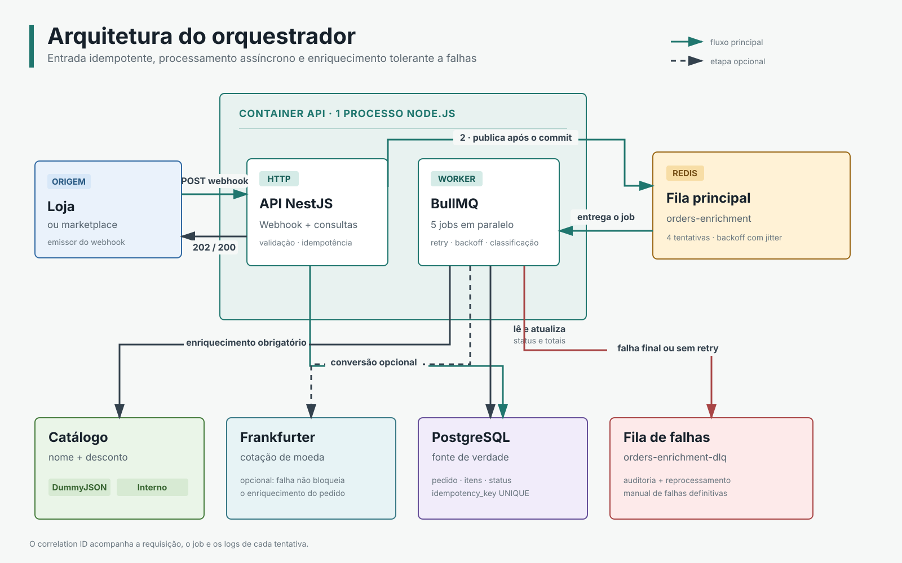
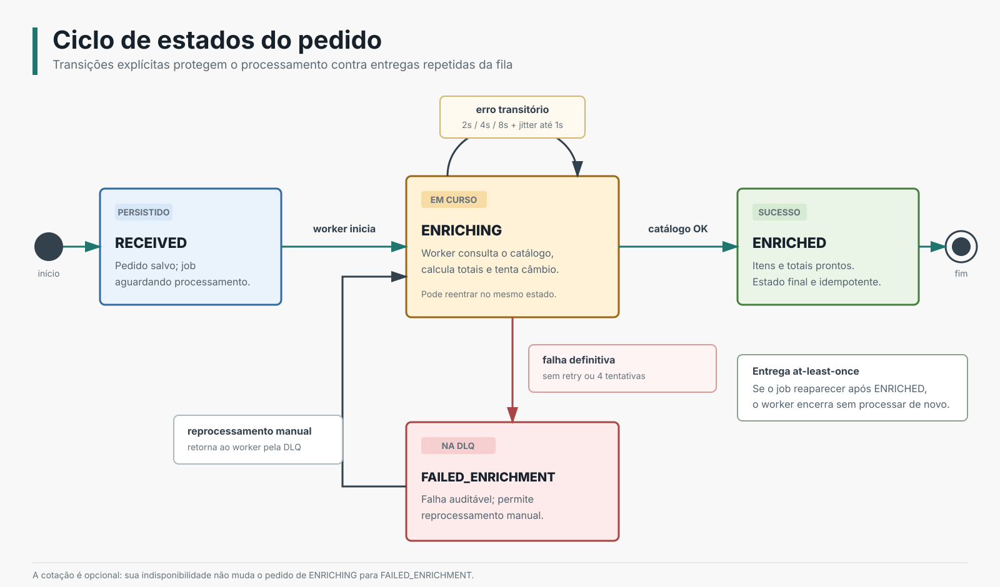

# Orquestrador de Pedidos

A API recebe pedidos por webhook, garante que o mesmo pedido não seja processado duas vezes,
joga o trabalho pesado numa fila e completa as informações que faltam consultando **dois
serviços externos públicos e gratuitos**: um catálogo de produtos e uma API de cotação de
moedas. Tem retry com backoff, fila de falhas e endpoints de consulta.

| Ferramenta              | Para quê serve aqui                                                                                |
| ----------------------- | -------------------------------------------------------------------------------------------------- |
| NestJS 11               | framework da API                                                                                   |
| PostgreSQL 16 + TypeORM | banco de dados e migrations versionadas                                                            |
| Redis 7 + BullMQ        | fila de processamento assíncrono e retry                                                           |
| Pino                    | biblioteca de log. Grava cada evento como uma linha de JSON, o que permite filtrar e buscar depois |
| Docker Compose          | sobe tudo com um comando                                                                           |

## Como rodar

Você precisa de Docker e nada mais. Node local só é necessário para rodar os testes.

```bash
npm run docker:up      # sobe api, postgres e redis. cria as tabelas no boot
npm run docker:logs    # acompanha o log da api
npm run docker:down    # derruba tudo
```

A primeira execução baixa imagens e compila, então leva alguns minutos. Depois sobe em segundos.
Com tudo no ar:

- **Swagger:** http://localhost:3000/docs, que já vem com dois payloads de exemplo. Clique em
  _Try it out_, escolha um exemplo no dropdown e execute: o pedido percorre o fluxo inteiro.
- **Métricas da fila:** http://localhost:3000/queue/metrics

| Método | Rota                           | O que faz                                                                                       |
| ------ | ------------------------------ | ----------------------------------------------------------------------------------------------- |
| `POST` | `/webhooks/orders`             | recebe o pedido. Devolve `202` se é novo, `200` se é repetido, `422` se o payload está inválido |
| `GET`  | `/orders?status=&page=&limit=` | lista os pedidos, do mais recente para o mais antigo. Filtro por status é opcional              |
| `GET`  | `/orders/:id`                  | mostra um pedido com os itens. `404` se não existe                                              |
| `GET`  | `/queue/metrics`               | quantos jobs existem em cada estado, na fila principal e na de falhas                           |

Para recomeçar de um estado limpo, apagando banco e fila, rode os dois em sequência:

```bash
docker compose down -v
npm run docker:up
```

### Variáveis de ambiente

Não precisa configurar nada: o `npm run docker:up` copia o `.env.example` para `.env` se ele
ainda não existir. O arquivo inteiro:

```bash
NODE_ENV=development
PORT=3000
LOG_LEVEL=info

DB_HOST=localhost                                # veja a nota sobre a porta 5434 abaixo
DB_PORT=5434
DB_USER=orquestrador
DB_PASS=orquestrador
DB_NAME=orquestrador

REDIS_HOST=localhost
REDIS_PORT=6379

ENRICHMENT_DEFAULT_SOURCE=dummyjson              # catálogo usado quando o pedido não manda "source"
ENRICHMENT_TIMEOUT_MS=3000                       # quanto esperar um serviço externo por tentativa
DUMMYJSON_BASE_URL=https://dummyjson.com

CONVERSION_TARGET_CURRENCY=USD                   # moeda base. Pedido que chega nela não converte
EXCHANGE_BASE_URL=https://api.frankfurter.app    # aponte para um host inválido pra ver a degradação
```

O Postgres é publicado na porta **5434** porque os comandos de migration rodam na sua máquina,
fora do container, e a 5432 normalmente já está ocupada por uma instalação local. Dentro da rede
do Compose o banco continua na 5432, e o `docker-compose.yml` sobrescreve `DB_HOST`, `DB_PORT` e
`REDIS_HOST` só para o serviço da API. Os dois caminhos funcionam sem editar arquivo no meio.

### Testes

```bash
npm test                 # 27 testes unitários, roda em segundos

npm run test:infra       # sobe o postgres e o redis de teste e espera ficarem prontos
npm run test:e2e         # 6 testes de ponta a ponta
npm run test:infra:down  # derruba a infra de teste
```

O `test:infra` sobe um Postgres e um Redis próprios, nas portas 5433 e 6380, para não conflitar
com o ambiente de desenvolvimento. Eles guardam os dados em memória, porque banco de teste não
precisa sobreviver a nada.

A suíte de ponta a ponta roda **sem internet e sem nenhum `sleep`**: ela espera por eventos
reais da fila, em vez de dormir um tempo arbitrário e torcer para ter terminado.

## Os dois serviços externos

O pedido chega magro: o item traz só `sku`, `qty` e `unit_price`, sem nome de produto e sem
desconto. Quem completa isso são os dois serviços, ambos sem cadastro e sem chave de API.

**[DummyJSON](https://dummyjson.com/docs/products)** é um catálogo de produtos de teste. Dele
saem o nome do produto e o percentual de desconto, que origina o cálculo de preço final. É o
serviço obrigatório: se ele falhar, o pedido não fica pronto.

**[Frankfurter](https://frankfurter.dev)** é uma API de cotação de moedas, alimentada pelo Banco
Central Europeu. Quando o pedido chega em moeda diferente da base, ele converte o total. É
opcional: se a cotação não vier, o pedido fecha normalmente e só os campos de conversão ficam
vazios.

### Como montar o SKU

O SKU diz de qual catálogo o produto vem, com um prefixo no formato `PREFIXO-id`:

| SKU                 | De onde vem                                 | Funciona?                                                   |
| ------------------- | ------------------------------------------- | ----------------------------------------------------------- |
| `DJ-1` até `DJ-194` | DummyJSON, por HTTP de verdade              | sim, são os 194 produtos que a API tem                      |
| `DJ-195` ou maior   | DummyJSON                                   | não. A API devolve 404 e o pedido vai para a fila de falhas |
| `IC-1` até `IC-4`   | catálogo interno, escrito no próprio código | sim, e sem acessar a rede                                   |
| `ABC123`            | nenhum                                      | não. Sem prefixo conhecido, vai para a fila de falhas       |

O catálogo interno tem quatro produtos fixos e existe por dois motivos: prova que trocar de
provedor é só mudar o `source`, e serve de dublê nos testes, que por isso rodam offline e sempre
com o mesmo resultado.

Um payload pronto para copiar e colar:

```json
{
  "order_id": "ext-123",
  "idempotency_key": "9f2e6c0d-5b81-4a7e-a3f1-c8e27b444d19",
  "source": "dummyjson",
  "currency": "BRL",
  "customer": { "email": "ana.silva@email.com", "name": "Ana Silva" },
  "items": [{ "sku": "DJ-15", "qty": 2, "unit_price": 59.9 }]
}
```

O `source` é opcional: sem ele, vale o `ENRICHMENT_DEFAULT_SOURCE` do ambiente. E mandando esse
mesmo payload duas vezes, a segunda resposta vem `200` com o pedido que já existia, em vez de
criar outro.

## Arquitetura

[](docs/diagrams/architecture-overview.svg)

A API e o worker rodam no mesmo processo, por decisão consciente. O custo disso está em
[API e worker no mesmo processo](#api-e-worker-no-mesmo-processo).

## O ciclo de um pedido

[](docs/diagrams/order-processing-flow.svg)

[](docs/diagrams/order-state-lifecycle.svg)

Fila pode entregar o mesmo job duas vezes. Isso não é defeito, é como fila funciona, e
acontece. Por isso o próprio pedido recusa qualquer pulo de etapa: um pedido `RECEIVED` não vira
`ENRICHED` sem passar por `ENRICHING`, e um pedido que já terminou não volta a ser processado.
Quem tentar forçar recebe um erro na hora.

## Decisões e trade-offs

| Tema               | Decisão                                                         | O que foi descartado                      |
| ------------------ | --------------------------------------------------------------- | ----------------------------------------- |
| Fila               | BullMQ com Redis                                                | RabbitMQ, que exige bem mais configuração |
| Idempotência       | `UNIQUE` no banco, tratamento do erro `23505` e `jobId` na fila | lock distribuído no Redis                 |
| Retry              | 4 tentativas, com backoff crescente e aleatório                 | retry dentro do cliente HTTP              |
| Falha definitiva   | fila própria de falhas e status `FAILED_ENRICHMENT`             | a lista interna de falhas do BullMQ       |
| Ordem das escritas | enfileirar depois do commit, e documentar a brecha              | outbox transacional                       |
| Provedores         | interface e factory que resolvem pelo `source`                  | um `switch` que cresce a cada plataforma  |

**Idempotência em três camadas.** A trava real é o `UNIQUE` na coluna `idempotency_key`: é
atômica e funciona mesmo com o Redis fora. O repositório não consulta antes de inserir, porque
duas requisições no mesmo instante passariam as duas pela consulta; ele insere, deixa o Postgres
recusar e devolve o pedido que já existia. O id do job é essa mesma chave, então a fila também
não duplica. E pedido repetido recebe `200`, não erro, porque quem envia webhook entende erro
como "não chegou" e passa a reenviar mais rápido ainda.

**O erro é classificado antes de tentar de novo.** Sem resposta nenhuma (timeout, DNS, conexão
recusada) o problema é passageiro e vale nova tentativa. Com resposta, só 429 e 5xx merecem
retry: um 404 de SKU inexistente vai para a fila de falhas na primeira tentativa, porque as
outras três receberiam o mesmo 404. E o retry vive só na fila, nunca no cliente HTTP: nas duas
camadas ele multiplica, e 3 tentativas vezes 3 viram 9 chamadas.

**A fila de falhas é uma fila de verdade.** DLQ quer dizer _dead letter queue_, a fila onde
param os jobs que falharam em definitivo. O BullMQ já tem uma lista interna de falhas, mas ela é
detalhe da biblioteca e é limpa por retenção. Uma fila própria pode ser inspecionada, aparece no
`/queue/metrics` e permite reprocessar na mão. Cada registro guarda o payload original, quantas
tentativas houve, a lista de erros, o horário e qual provedor falhou.

**Dinheiro em conta de inteiro.** As colunas são `numeric(12,2)` com um conversor na leitura,
porque o driver do Postgres devolve `numeric` como texto e `subtotal + total` viraria
concatenação de string em vez de soma. E o desconto é calculado em centavos:

```
59.90 * 0.95        em float    dá 56.904999999999994, que arredonda para 56.90  (errado)
5990 * 9500 / 10000 em inteiro  dá 5690.5, que arredonda para 56.91              (certo)
```

O erro do float nesse caso é grande demais para os truques usuais de arredondamento, e o cliente
perderia um centavo sem ninguém perceber.

**Catálogo é obrigatório, cotação é opcional.** Catálogo define preço, então falha nele vira
retry e, insistindo, fila de falhas. Cotação é informação derivada: se não vier, o pedido fecha
como `ENRICHED` com os campos de conversão vazios e um aviso no log. Descartar um enriquecimento
que deu certo por causa de uma chamada secundária seria jogar trabalho bom no lixo. E não existe
cotação de reserva fixa no código: inventar número em campo de dinheiro é pior que deixar vazio.

**Um id que atravessa o sistema todo.** Vem do header `x-correlation-id`, ou é gerado se não
vier, volta na resposta, viaja dentro do job e é recuperado no worker. Buscar por um único id
conta a história completa do pedido, com cada tentativa:

```
INFO  job de enriquecimento enfileirado   req.id=jornada-8002
INFO  request completed                   [21ms]
INFO  enriquecimento iniciado             attempt=1
INFO  chamada externa concluida           url=.../products/7 httpStatus=null latencyMs=30
WARN  tentativa 1 falhou: ENOTFOUND       provider=dummyjson sku=DJ-7
INFO  enriquecimento iniciado             attempt=2      (2.4s depois)
INFO  enriquecimento iniciado             attempt=3      (4.7s depois)
INFO  enriquecimento iniciado             attempt=4      (8.5s depois)
ERROR pedido foi pra dlq                  attempts=4
```

Os intervalos do backoff aparecem nos próprios horários. Dados sensíveis não vão para o log
(header de autorização e e-mail do cliente), e erro 500 devolve mensagem genérica ao cliente,
deixando o stack trace só no log.

### API e worker no mesmo processo

O gargalo deste sistema é extensibilidade, integrar a vigésima plataforma sem reescrever nada,
e não volume de requisição. Um processo só entrega isso e sobe com um comando.

O custo aparece quando algo dá errado: **se a API cair, ou mesmo durante um deploy normal, o
trabalho já aceito para de andar.** Com 5 mil jobs na fila, concorrência 5 e cerca de 780ms por
chamada externa (número medido), o worker escoa uns 6 pedidos por segundo. Dez minutos de API
fora são dez minutos de fila parada, enquanto quem envia os webhooks continua reenviando, então
a rajada acumulada chega em cima do que não andou. Separados, esses mesmos dez minutos escoariam
uns 4 mil pedidos.

O código já está pronto para separar: o job carrega só o id do pedido, o encerramento termina o
job que está na mão antes de morrer, e o id de correlação viaja no job. Faltaria decidir por
variável de ambiente quem é API e quem é worker.

## O que ficou de fora

Rate limit no webhook, cache do catálogo no Redis e circuit breaker por provedor ficaram de
fora de propósito: nenhum deles muda o fluxo que o exercício pede, e os três só se pagam com
volume real. No código há dois `TODO` marcando lugar, um para o rate limit e outro para tirar
as migrations do boot, que é conveniente para subir em um comando e errado com várias réplicas,
porque elas competem pelo mesmo lock.

## Contratos completos

O `/docs` publica o OpenAPI com todas as tipagens: campos obrigatórios e opcionais, tipos,
formatos, os valores possíveis de status e o corpo de cada resposta, incluindo as de erro. Quem
quiser se aprofundar no contrato encontra tudo lá, sem precisar abrir o código.

## Sobre

Projeto desenvolvido como teste técnico Inbazz.
